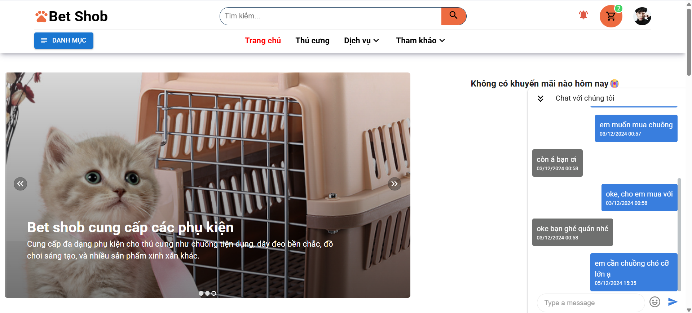

**Lưu ý:** Vì lý do tổng hợp lại nội dung nhằm đồng nhất repo giữa các dự án, đây sẽ là repository tổng hợp lại từ các repositoy của dự án **PetShop**
- **Link repo front-end user gốc:** https://github.com/ToitenDang/PetsShop_client
- **Link repo front-end admin gốc:** https://github.com/PhamHuuTuan21110713/PetShop_Management
- **Link repo back-end gốc:** https://github.com/PhamHuuTuan21110713/PetsShop_API

# PetShop - Website Thương mại điện tử buôn bán sản phẩm cho thú cưng
**PetShop** là một nền tảng thương mại điện tử giúp buôn bán các sản phẩm dành cho thú cưng với đa dạng các danh mục và sản phẩm, cung cấp hơn 100 sản phẩm cho thú cưng.

# Phía người dùng
## Đăng ký

## Đăng nhập

## Trang chủ

## Lọc sản phẩm

## Đặt lịch hẹn

## Giỏ hàng

## Thông báo

## Thông tin

## Đơn hàng

## Hoạt động
